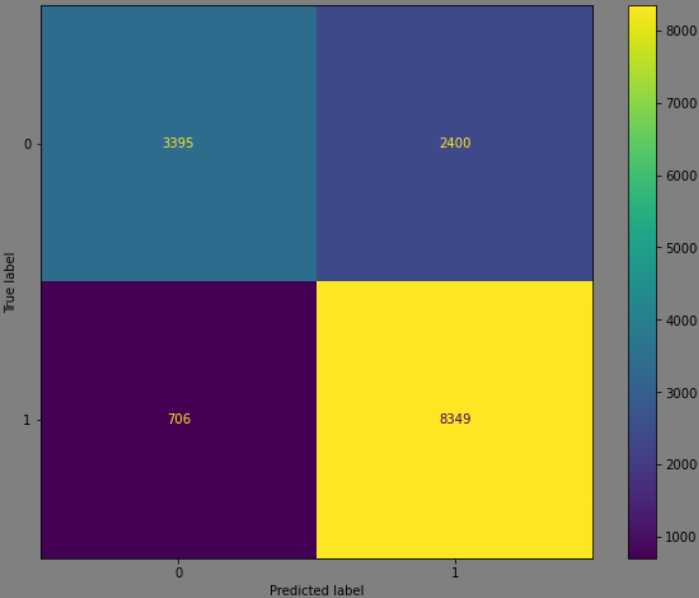

<!-- PROJECT SHIELDS -->

[![Contributors][contributors-shield]][contributors-url]
[![Activity][activity-shield]][activity-url]
<!-- [![Stargazers][stars-shield]][stars-url] -->
Eddie \
Brian 
 

<!-- TABLE OF CONTENTS -->

  
Table of Contents

  <ol>
    <li>
      <a href="#business-problem">Business Problem</a>
    </li>
    <li><a href="#data">Data</a></li>
    <li><a href="#results">Results</a></li>
    <li><a href="#conclusions">Conclusions</a></li>
    <li><a href="#next-steps">Next Steps</a></li>
  </ol>

<!-- Business Proposal -->
## Business Problem

<h3 align="center">Predicting Tanzanian Well Functionality</h3>

This project aims to build a model to accurately predict the functionality of Tanzanian wells in order to efficiently allocate resources to have them repaired. We deemed false positives, wells predicted functional but in reality are not, to be worse than a false negative, wells predicted non-functional but are in fact functional. Thus our model was built penalizing false positives.

## Data
The data comes from from Taarifa and the Tanzanian Ministry of Water and hosted on DrivenData. The data stores various attributes of wells ranging from the water quality to the subvillage it belongs to.
* [DrivenData](https://www.drivendata.org/competitions/7/pump-it-up-data-mining-the-water-table) 
* [Taarifa](https://taarifa.org/) 
* [Tanzanian Ministry of Water](https://www.maji.go.tz/) 

## Results

### Baseline model built using Logistic Regression performs very poorly when predicting non-functional wells

### Baseline model with tuned hyperparamters and categorial features performs much better, but still lacking

### A Random Forest classifier performed a considerable amount better than the Logistic Regression model

### The Random Forest classifier but penalizing the model in predicting false positives. Results, in less false positives, but more false negatives, which is ok for our case.

### The graph measuring the accuracies and scores accross the model. On the final one, we lose out slightly on test accuracy and a fair bit of recall, but our specificity is better which is what we are aiming for.

### Using two different metrics to explore what the model deemed as important features in predicting accurately, we find that the highlighted features show up in both of the top 10 of each metric. We deem these as the most important for accurate prediction.

## Conclusions
* **A Random Forest Classifier performed best** The Random Forest Classifier ended getting the highest accuracy. We ended up penalizing false positives which hurt our accuracy and recall slightly, but improved our specificity which is where we want our model to be.
* **Quantity group (seasonal, insufficient, enough), extraction type group gravity, years active, and latitude are the most important features** When measuring the impact of features using mean decrease in impurity and feature importance permutation, these features where the ones that appeared in both graphs when looking at the top 10 of each metric.

## Next Steps
Further steps
* Manually explore high cardinality features, many have 1000+ unique entries, and reduce them by generalizing them so they can be used in the model without overfitting
* Rebuild model to focus on recall as opposed to specificity since false negatives still require time and resources to check.

<!-- https://home.aveek.io/GitHub-Profile-Badges/ -->

<!-- LINKS & IMAGES -->
[contributors-shield]: https://img.shields.io/github/contributors/Zxhjlk/Phase3Project.svg?style=for-the-badge
[contributors-url]: https://github.com/Zxhjlk/Phase3Project/graphs/contributors
[activity-shield]: https://img.shields.io/github/last-commit/Zxhjlk/Phase3Project?style=for-the-badge
[activity-url]: https://github.com/Zxhjlk/Phase3Project/activity

[Solidity]: https://img.shields.io/badge/Solidity-363636.svg?style=for-the-badge&logo=Solidity&logoColor=white
[Solidity-url]: https://soliditylang.org/

[Pytorch]: https://img.shields.io/badge/PyTorch-EE4C2C.svg?style=for-the-badge&logo=PyTorch&logoColor=white
[Pytorch-url]: https://pytorch.org/

[React]: https://img.shields.io/badge/React-61DAFB.svg?style=for-the-badge&logo=React&logoColor=black
[React-url]: https://react.dev/

[FastAPI]: https://img.shields.io/badge/FastAPI-009688.svg?style=for-the-badge&logo=FastAPI&logoColor=white
[Fast-url]: https://fastapi.tiangolo.com/